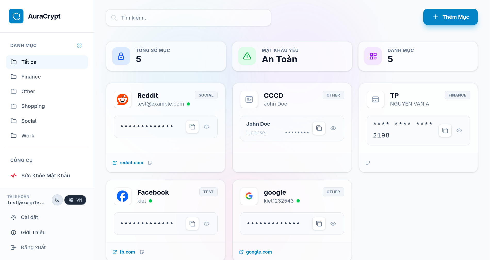
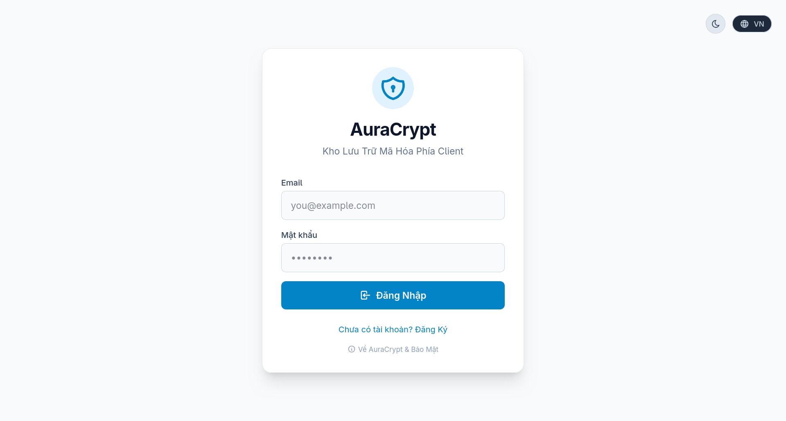
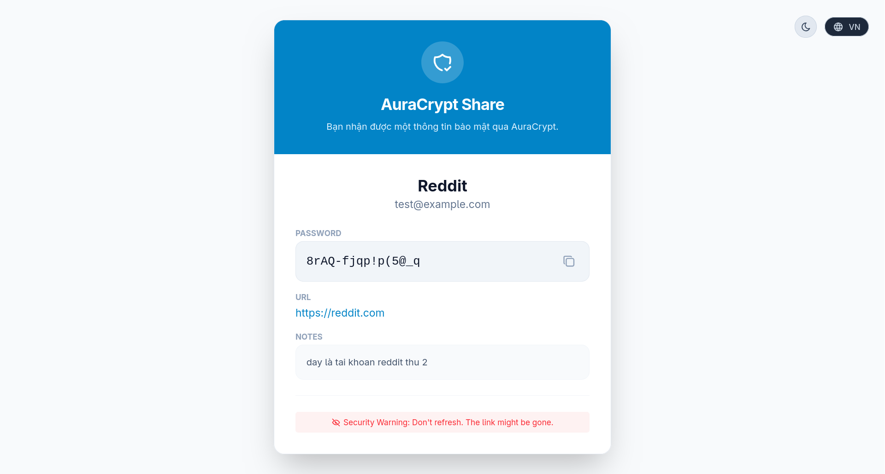

# AuraCrypt

AuraCrypt is a secure, end-to-end encrypted vault for managing your sensitive data. Built with modern web technologies, it ensures that your data remains private using robust Web Crypto API standards (PBKDF2 & AES-GCM).

## 📸 ScreenShots


*Giao diện quản lý chính (Dashboard)*

<p align="center">
  
  
</p>

## 🚀 Features

- **End-to-End Encryption:** Your data is encrypted locally in the browser using AES-GCM before being stored.
- **Secure Key Derivation:** Uses PBKDF2 with 100,000 iterations for secure master password derivation.
- **Browser Extension Integration:** Includes a companion extension for seamless access across the web.
- **Multi-language Support (i18n):** Accessible to a global audience.
- **Sharing & Vault Health Checks:** Securely share entries and monitor your vault's health.
- **Modern UI:** Full theming support (Dark/Light mode) powered by Tailwind CSS v4.

## 🛠 Tech Stack

- **Frontend:** React, TypeScript, Vite
- **Styling:** Tailwind CSS v4
- **State Management:** Zustand
- **Backend/Storage:** Supabase
- **Cryptography:** Native Web Crypto API

## 📦 Getting Started

### Prerequisites

- Node.js (v18 or higher recommended)
- npm or yarn

### Installation

1. Install dependencies:
   ```bash
   npm install
   ```

2. Environment Variables:
   Create a `.env` file in the root directory and add your Supabase credentials (since the project uses `supabaseClient.ts`):
   ```env
   VITE_SUPABASE_URL=your_supabase_project_url
   VITE_SUPABASE_ANON_KEY=your_supabase_anon_key
   ```

3. Start the development server:
   ```bash
   npm run dev
   ```

### Building for Production & Extension

To build the web application and browser extension:
```bash
npm run build
```
*(The output will be generated in the `dist` directory, which also includes `manifest.json` and `content.js` for the Chrome/Edge extension).*

## 🔒 Security Architecture

AuraCrypt is designed with a "zero-knowledge" architecture. The server never sees your plain-text data or your master password.
- **Master Key:** Derived from your master password using PBKDF2.
- **Data Encryption:** All vault entries are encrypted using AES-GCM 256-bit.
- **Breach Checks:** Uses SHA-1 strictly for k-Anonymity checks (e.g., Have I Been Pwned integration).
